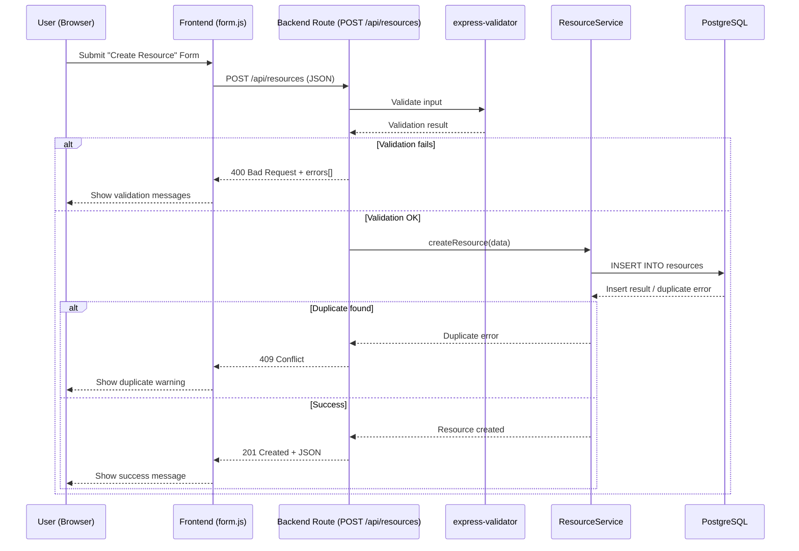
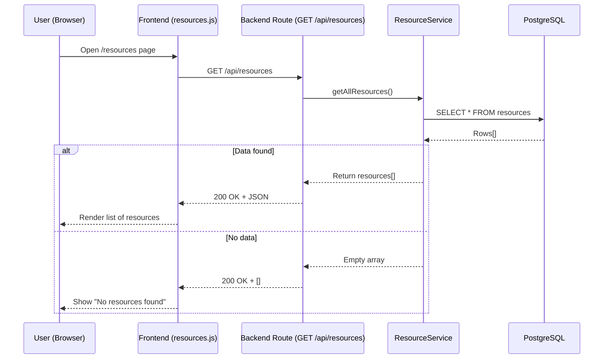
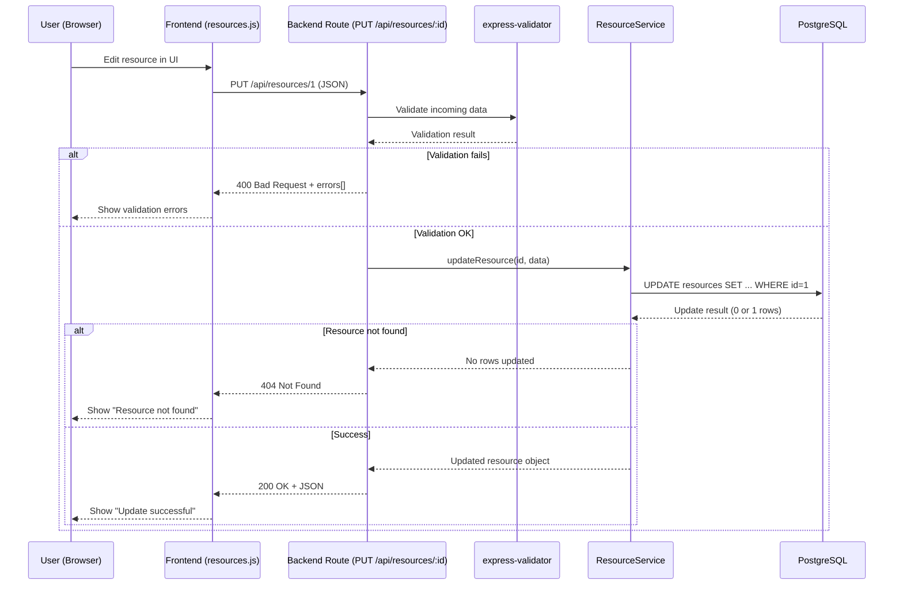
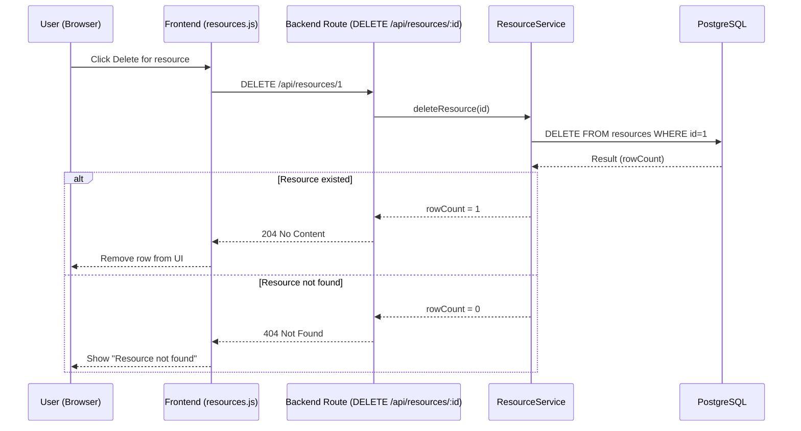

# 1️⃣ CREATE – Resource (Sequence Diagram)

# 2️⃣ READ — Resource (Sequence Diagram)

# 3️⃣ UPDATE — Resource (Sequence Diagram)

# 4️⃣ DELETE — Resource (Sequence Diagram)

alt Client validation fails
    F-->>U: Show validation error
    Note over F,B: No HTTP request sent

