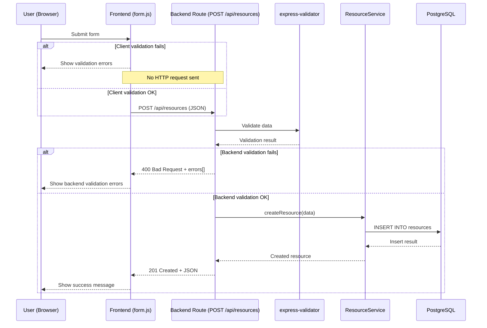
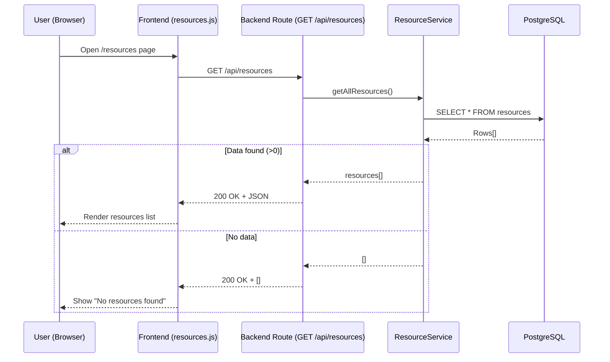
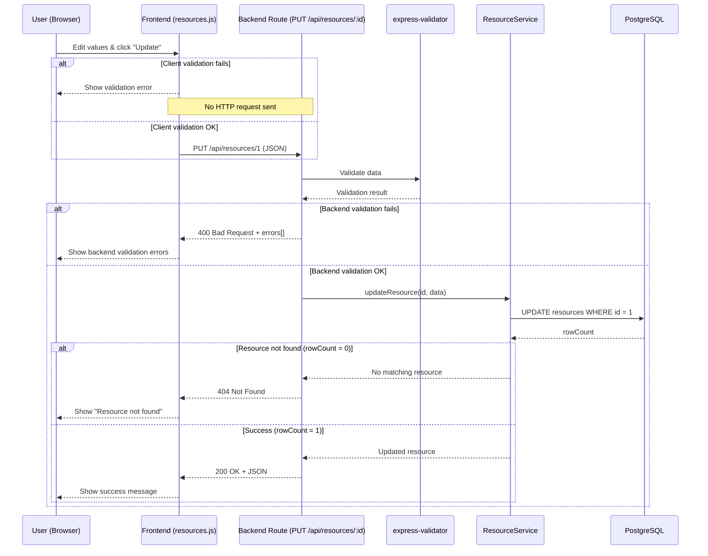
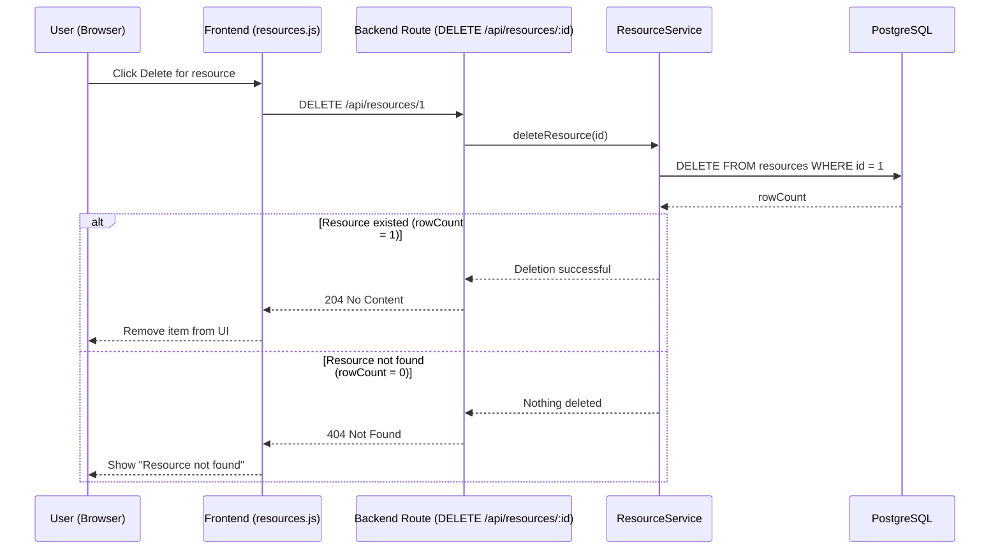

# 1️⃣ CREATE – Resource (Sequence Diagram)

```mermaid
sequenceDiagram
    participant U as User (Browser)
    participant F as Frontend (form.js)
    participant B as Backend Route (POST /api/resources)
    participant V as express-validator
    participant S as ResourceService
    participant DB as PostgreSQL

    U->>F: Submit form

    %% Frontend validation
    alt Client validation fails
        F-->>U: Show validation errors
        Note over F,B: No HTTP request sent
    else Client validation OK
        F->>B: POST /api/resources (JSON)
    end

    %% Backend validation
    B->>V: Validate data
    V-->>B: Validation result

    alt Backend validation fails
        B-->>F: 400 Bad Request + errors[]
        F-->>U: Show backend validation errors
    else Backend validation OK
        B->>S: createResource(data)
        S->>DB: INSERT INTO resources
        DB-->>S: Insert result
        S-->>B: Created resource
        B-->>F: 201 Created + JSON
        F-->>U: Show success message
    end
```

# 2️⃣ READ — Resource (Sequence Diagram)

```mermaid
sequenceDiagram
    participant U as User (Browser)
    participant F as Frontend (resources.js)
    participant B as Backend Route (GET /api/resources)
    participant S as ResourceService
    participant DB as PostgreSQL

    U->>F: Open /resources page
    F->>B: GET /api/resources

    B->>S: getAllResources()
    S->>DB: SELECT * FROM resources
    DB-->>S: Rows[]

    alt Data found (>0)
        S-->>B: resources[]
        B-->>F: 200 OK + JSON
        F-->>U: Render resources list
    else No data
        S-->>B: []
        B-->>F: 200 OK + []
        F-->>U: Show "No resources found"
    end
```

# 3️⃣ UPDATE — Resource (Sequence Diagram)

```mermaid
sequenceDiagram
    participant U as User (Browser)
    participant F as Frontend (resources.js)
    participant B as Backend Route (PUT /api/resources/:id)
    participant V as express-validator
    participant S as ResourceService
    participant DB as PostgreSQL

    U->>F: Edit values & click "Update"

    %% Frontend validation
    alt Client validation fails
        F-->>U: Show validation error
        Note over F,B: No HTTP request sent
    else Client validation OK
        F->>B: PUT /api/resources/1 (JSON)
    end

    %% Backend validation
    B->>V: Validate data
    V-->>B: Validation result

    alt Backend validation fails
        B-->>F: 400 Bad Request + errors[]
        F-->>U: Show backend validation errors
    else Backend validation OK
        B->>S: updateResource(id, data)
        S->>DB: UPDATE resources WHERE id = 1
        DB-->>S: rowCount

        alt Resource not found (rowCount = 0)
            S-->>B: No matching resource
            B-->>F: 404 Not Found
            F-->>U: Show "Resource not found"
        else Success (rowCount = 1)
            S-->>B: Updated resource
            B-->>F: 200 OK + JSON
            F-->>U: Show success message
        end
    end
```

# 4️⃣ DELETE — Resource (Sequence Diagram)

```mermaid
sequenceDiagram
    participant U as User (Browser)
    participant F as Frontend (resources.js)
    participant B as Backend Route (DELETE /api/resources/:id)
    participant S as ResourceService
    participant DB as PostgreSQL

    U->>F: Click Delete for resource #1
    F->>B: DELETE /api/resources/1

    B->>S: deleteResource(id)
    S->>DB: DELETE FROM resources WHERE id = 1
    DB-->>S: rowCount

    alt Resource existed (rowCount = 1)
        S-->>B: Deletion successful
        B-->>F: 204 No Content
        F-->>U: Remove item from UI
    else Resource not found (rowCount = 0)
        S-->>B: Nothing deleted
        B-->>F: 404 Not Found
        F-->>U: Show "Resource not found"
    end
```

